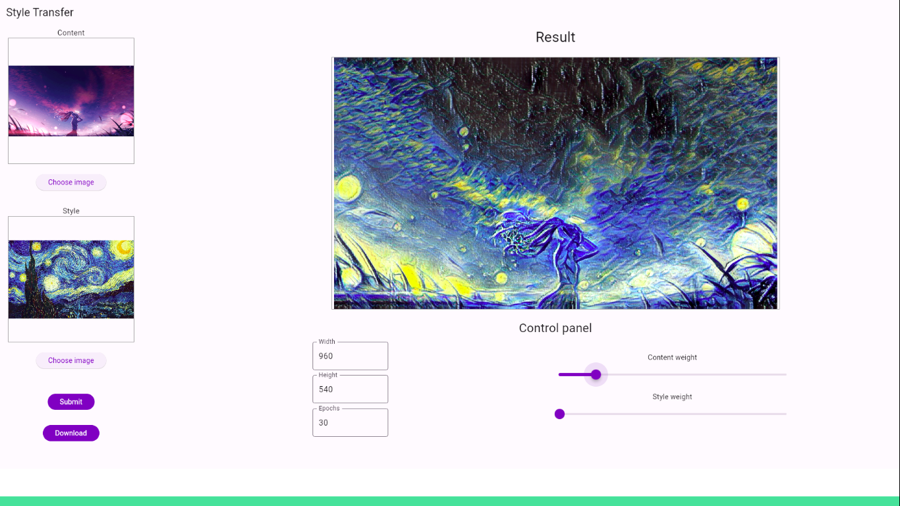
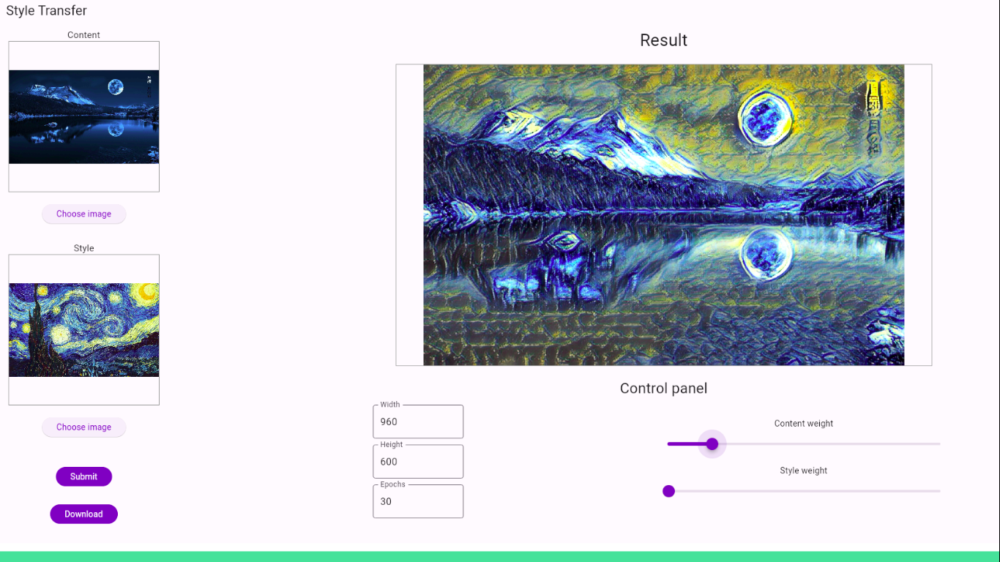
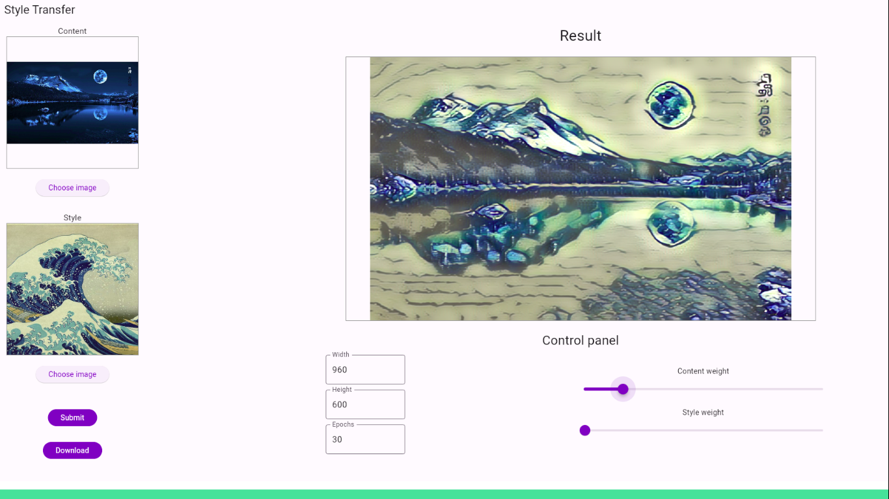
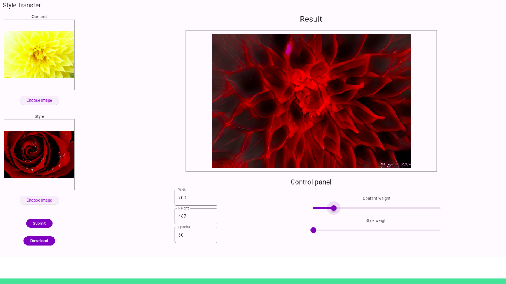
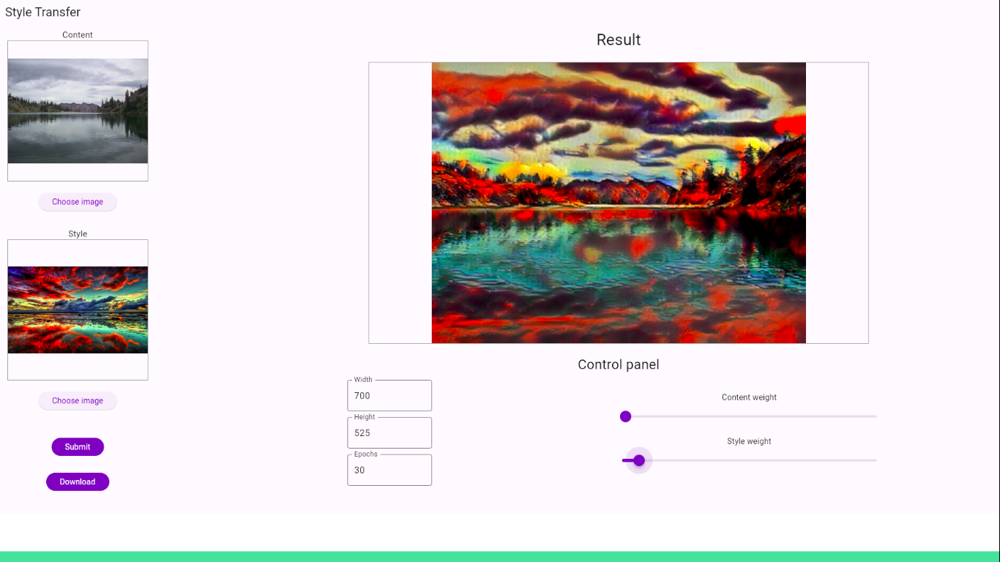
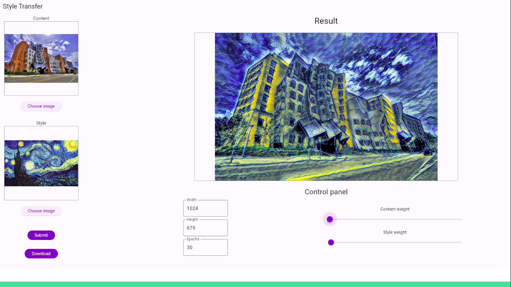
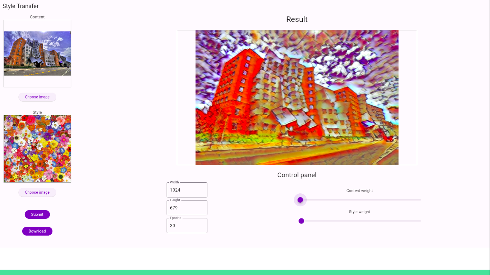

# Style Transfer

## Project Description
Program which takes two images and transfers style of the second to the first one. It connects to API to transfer the style and has web page interface.

## Requirements
* Python 3.8 (api)
* Flutter (web instance)

## How to run
1. Clone repository
2. Run the API (see [api/README.md](api/README.md))
3. Run flutter app as web instance

## How to use
1. Open the app
2. Select content image
3. Select style image
4. Press "Submit" button

## Presentation
[Presentation PDF](examples/StyleTransfer.pdf)

## Examples

