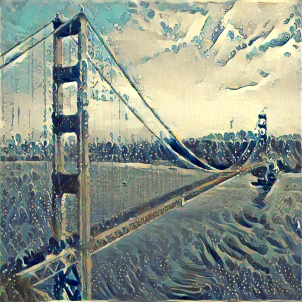
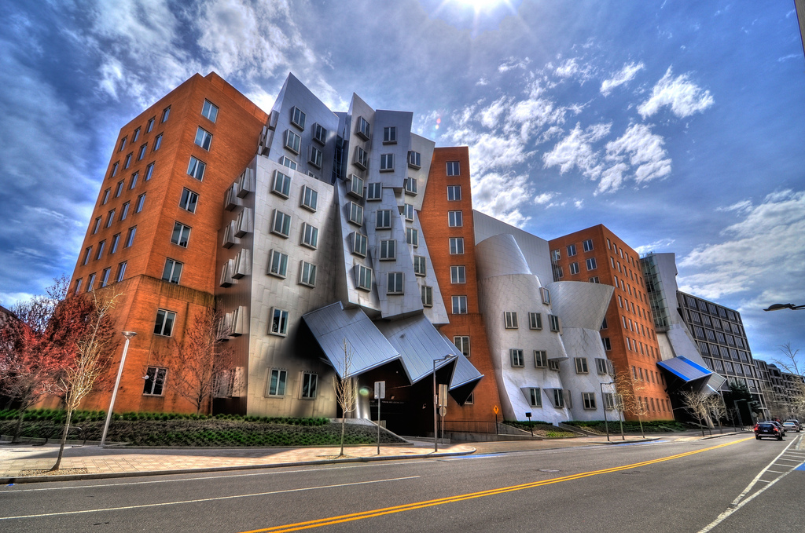

# Style Transfer
- Problem: You have two images, and want to see how the first image will look like in style of the style image (briefly, transfer style of the second image to the first)

- One of the solutions: Provided in this [article](https://arxiv.org/pdf/1508.06576v2.pdf) idea to use neural network to do this.

We created a API that takes two image (content_image, style_image) and using the above idea trying to transfer the style of the second image onto first one.

# Hyperparameters of the model

The API takes content and style image, and lots of different parameters (query), the main parameters you might want to change is `image_size`, `timeout_sec`, `content_weight`, `style_weight`, `tv_weight`, `epochs`. You can find full list of parameters in `model.utils:setup_style_transfer()`.

# Demonstration (content/style/generated image)
## Example1

## Example2

## Example3

## Example4

## Example5

## Example6

